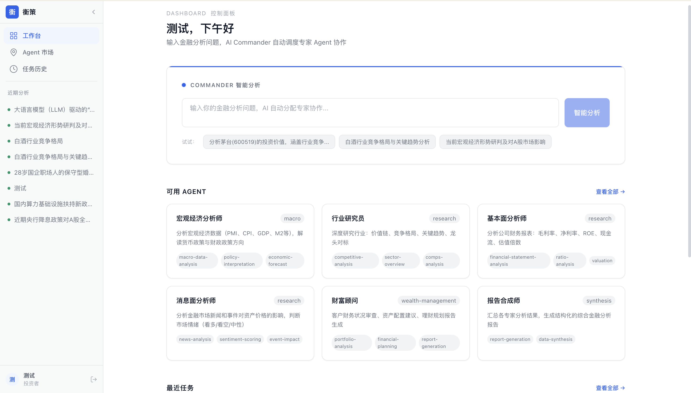
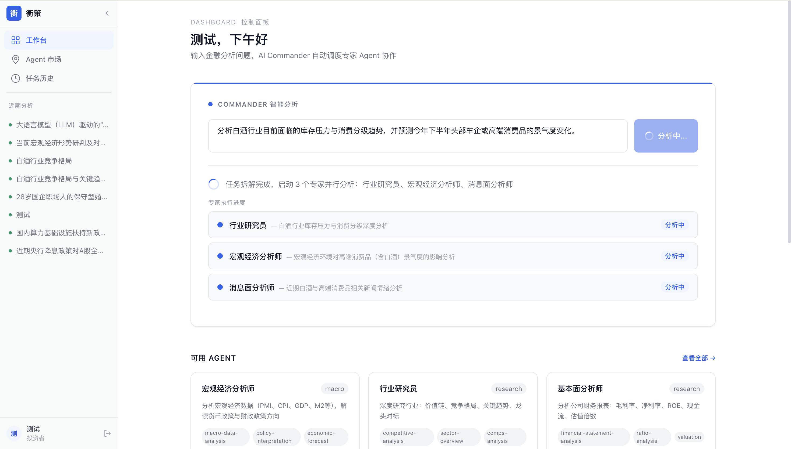
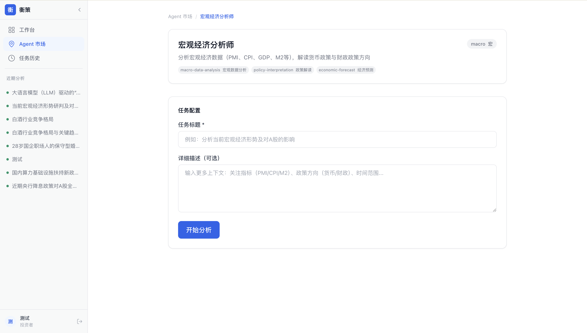
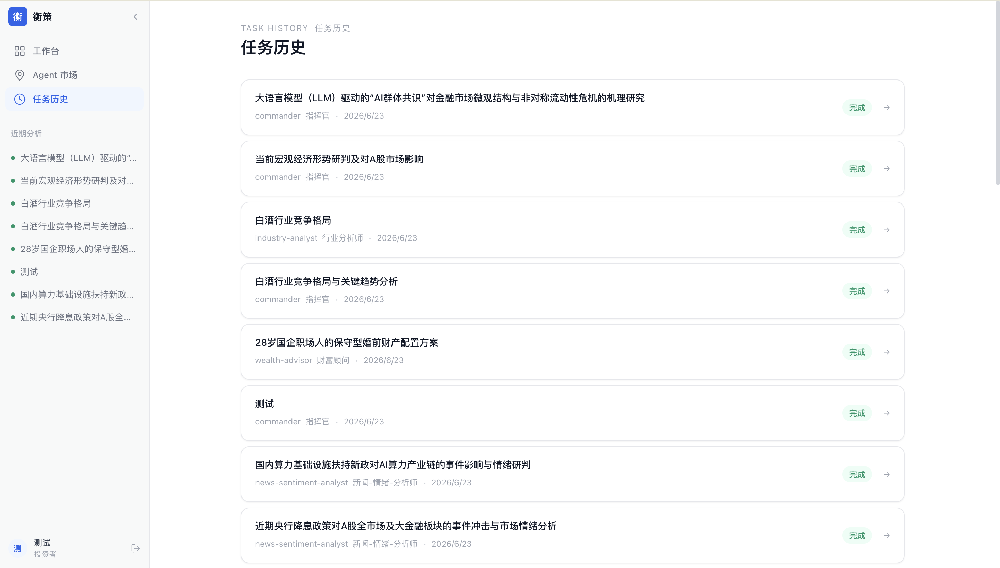
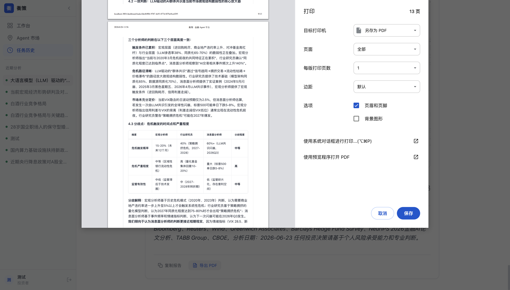

# 弈金：基于多 Agent 协作的金融 AI 数字员工平台

> **第十七届"工行杯"全国大学生金融科技创新大赛 · 校赛策划书**
>
> **一句话说清楚**：让 AI 从"一个聪明人"进化为"一支金融分析团队"——Commander 拆解任务，6 个专精 Agent 并行分析，每一条结论都可追溯来源。

---

## 一、项目摘要

### 1.1 这是什么？

**弈金**是一个多 Agent 协作的金融 AI 数字员工平台。它的核心逻辑很简单：

> 金融从业者分析一个问题，从来不是一个人拍脑袋，而是一个团队分工协作——有人看宏观、有人看行业、有人拆财报、有人盯消息，最后有人统稿。弈金把这种"团队协作"模式搬到了 AI 里。

### 1.2 怎么做到的？

```
用户提一个问题
      ↓
Commander 自动判断需要哪些专业维度，拆解为子任务
      ↓
6 个 Specialist Agent 并行分析（宏观/行业/基本面/消息面/财富/报告合成）
      ↓
SSE 实时流式推送进度（用户能看到每个 Agent "正在分析中"）
      ↓
综合报告 + 搜索引用来源链接（每条结论有出处）
      ↓
一键导出 PDF / 复制 / 重新生成
```

### 1.3 为什么不同？

| 别人做的 | 我们做的 |
|---------|---------|
| 一个模型回答所有问题（面面俱到，点到为止） | 6 个专精 Agent 各管一摊（深度 + 广度） |
| 黑箱输出，不知道结论怎么来的 | 每个 Agent 推理过程独立存档，每条结论附搜索来源链接 |
| 对话式工具（问一句答一句） | 任务式平台（自动拆解 → 并行执行 → 综合报告） |

### 1.4 为什么是现在？

2026 年被称为"金融智能体元年"（陆家嘴论坛定调），工商银行已将战略从"数字工行"升级为"数智工行（AI-ICBC）"，建成"工银智涌"大模型体系并在 500+ 场景落地 AI 应用。行业正在经历从"AI 试点"到"AI 规模化部署"的临界点——这正是弈金切入的时机窗口。

### 1.5 一句话记住这个项目

> **其他 AI 让你跟一个聪明人聊天，弈金让你拥有一支 AI 分析团队。**

---

## 二、项目背景与痛点分析

### 2.1 宏观背景：金融 AI 正从"试点"走向"规模部署"

| 指标 | 数据 | 来源 |
|------|------|------|
| 2025 年金融大模型中标项目数 | 587 个（同比增 341%） | 智能超参数 |
| 2025 年披露中标金额 | 15.06 亿元（同比增 528%） | 智能超参数 |
| 银行业 AI 采购占比 | 75.2%（290 个项目） | 智能超参数 |
| 2026 年业界定义 | **"金融智能体元年"** | 2026 陆家嘴论坛 |
| 工商银行 AI 数字员工年承担工作量 | **5.5 万人年** | 工行 2025 年报 |
| 工行交易智能化比率 | 96% | 工行 2025 年报 |
| 工行 AI 落地场景数 | 500+ | 工行公开披露 |
| 平安集团已部署智能体 | 超 5 万个 | 公开披露 |
| 42 家 A 股上市银行 | 九成已部署 AI | 各银行年报 |
| 金融科技 AI 核心市场（2030E） | 6,200 亿元（CAGR 16.8%） | 艾瑞咨询 |

这些数字指向同一个趋势：**AI 在金融行业的角色正从"对话工具"升级为"数字劳动力"**。阿里云在 2026 年陆家嘴论坛提出"金融智能体新物种"概念——智能体正从"能说会道"向"能写会算"演进：不只是回答问题，而是理解目标、拆解任务、调用工具并持续执行。

### 2.2 一个分析师的一天：为什么金融行业需要"团队级"AI

早上 8:47，某城商行投研部。分析师张明把咖啡放在堆满打印研报的桌角，打开邮箱——31 封未读邮件：7 份晨会纪要、12 条行业快讯、5 份监管政策更新、4 份公司公告，还有零散的客户需求转发。他今天的任务是：下班前交出一份某新能源龙头的深度分析报告。

接下来的 5 个小时，张明在五个窗口之间来回切换：东方财富看行情、Wind 拉财务数据、证监会网站翻公告、行业公众号找研报、Excel 里手动整理可比公司表格。数据找齐了，问题才刚刚开始——宏观环境会不会变？行业竞争格局有没有新变化？公司财报里有没有隐藏风险？最近有没有负面消息被遗漏？每一个维度都是一项独立的脑力劳动。

下午 3:15，他开始写报告。时间只够把收集到的信息拼成综述，没有余力做深度交叉验证。晚上 7:40，报告发出去，他靠在椅子上，心里并不踏实——宏观部分写得够不够？行业那节有没有漏掉关键趋势？有没有哪条重要消息他没看到？

**这不是张明一个人的困境，而是金融行业"分析生产力"的结构性瓶颈。** 这个瓶颈可以分解为三个层次：

**层次一：多维分析需求 vs 单线程人脑**

金融分析天然是多维度的——宏观、行业、财务、消息面互相交织。但人脑只能串行思考，一个分析师在某个时刻只能聚焦一个维度。结果要么是"面面俱到但每个面都不深"，要么是"一个维度很深但其他维度是盲区"。

**层次二：可审计性需求 vs 黑箱工作过程**

2026 年 6 月，国家金融监管总局发布《关于银行业保险业人工智能安全开发应用的指导意见》，明确 AI 应用"须建立人工监督和干预机制""须向监管报告"。张明的报告里每一条结论有没有出处？每一步推理能不能回溯？如果他用了 AI 帮忙，审查者怎么知道哪些是 AI 写的、依据是什么？"黑箱"在金融监管框架下无法落地。

**层次三：统一调度需求 vs 碎片化工具**

张明做一份报告要在 5 个工具之间切换。放大到整个银行，投研、信贷、风控、合规、财富管理各自接入不同的 AI 工具，形成"AI 孤岛"。每个部门单独维护 prompt、数据源和模型参数，效率低且无法跨部门复用。工行 2025 年报显示科技员工 4.02 万人（占比 9.8%），金融科技投入 285.88 亿元——但大量重复性分析工作仍靠人工完成。**不是缺工具，是缺一个把工具组织成"团队"的调度层。**

### 2.3 弈金的回应

上述三个层次指向同一个需求：**金融行业不需要另一个聊天机器人，需要的是一个能像团队一样分工协作、过程透明可追溯、可统一调度的 AI 数字员工平台。** 这正是弈金的核心设计目标。

---

## 三、目标用户与需求分析

### 3.1 目标用户画像

| 用户类型 | 用户特征 | 核心需求 |
|----------|---------|---------|
| **银行投研分析师** | 每天需处理大量宏观数据、行业研报、公司公告 | 自动化信息收集与初筛，多维并行分析 |
| **信贷审批人员** | 需综合评估企业财务、行业前景、风险等级 | 多维度信息整合 + 风险自动识别 |
| **财富管理/理财经理** | 需根据客户画像推荐产品 | 个性化资产配置建议 + 产品适当性校验 |
| **合规风控人员** | 需实时监控监管政策变化 | 政策解读 + 合规检查清单自动生成 |

### 3.2 典型使用场景

**场景一：投研分析师 — 股票深度分析**

```
用户输入: "综合评估宁德时代当前投资价值"

Commander 自动拆解为 4 个子任务:
  ├── 宏观经济分析师: 当前新能源产业链的宏观政策环境与流动性影响
  ├── 行业研究员: 动力电池行业竞争格局、技术路线、产能周期分析
  ├── 基本面分析师: 宁德时代近 3 年财务数据深度分析（杜邦拆解 + 估值分位）
  └── 消息面分析师: 近期重大新闻事件对股价的潜在影响

→ 4 个 Agent 并行分析（约 2-3 分钟）
→ 报告合成师整合输出综合报告 + 搜索引用来源
→ 用户复核关键结论 → 一键导出 PDF

⏱ 传统方式：翻阅多份研报 + 手动整理数据，约 2-3 小时
⏱ 弈金：约 5 分钟（含人工复核）
```

**场景二：财富顾问 — 客户资产配置建议**

```
用户输入: "为一位 35 岁、年收入 50 万、风险偏好稳健的客户提供资产配置建议"

Commander 分派:
  ├── 财富顾问: 财务健康诊断 + 核心-卫星资产配置方案
  ├── 宏观经济分析师: 当前宏观环境对各大类资产的影响
  └── 消息面分析师: 近期市场情绪与事件风险

→ 输出: 含财务诊断 + 配置比例表 + 风险提示的结构化报告
⏱ 约 3 分钟
```

**场景三：信贷审批辅助 — 企业综合评估**

```
用户输入: "评估XX科技公司的信贷风险"

Commander 分派:
  ├── 基本面分析师: 偿债能力/现金流/盈利质量深度分析
  ├── 行业研究员: 行业前景与竞争地位分析
  └── 消息面分析师: 近期负面事件/诉讼/监管风险排查

→ 输出: 多维风险评估报告，每项结论附数据来源
→ 信贷审批人员基于报告做最终决策（Human-in-the-Loop）
⏱ 约 4 分钟
```

### 3.3 需求总结

核心需求集中在三个层面，弈金以"**智能编排 + 并行分析 + 可追溯报告**"三条功能轴线精准匹配：

1. **信息整合层面**：金融信息散落在新闻、研报、数据库、公告中，人工收集耗时巨大。多 Agent 分维度并行收集，将聚合时间从小时级压缩至分钟级。
2. **分析协作层面**：复杂问题需要"分而治之"。Commander + Specialist 模式原生支持任务拆解与并行执行。
3. **结果可信层面**：每个结论附带联网搜索来源链接，每个 Agent 的推理过程独立存档，满足合规审计要求。

---

## 四、产品方案设计

### 4.1 产品定位

弈金定位为**面向金融机构的 AI 数字员工调度平台**。它不是替代金融从业者，而是作为"AI 分析团队"承担信息收集、初步分析、报告草拟等重复性工作，让人类专家聚焦高价值判断。平台以 SaaS 多用户模式运行，同时支持私有化部署。

### 4.2 核心架构

```
                           ┌─────────────────────────┐
                           │       用户输入问题        │
                           └───────────┬─────────────┘
                                       │
                                       ▼
                           ┌─────────────────────────┐
                           │   Commander 任务拆解     │
                           │   · 识别问题类型         │
                           │   · 规划子任务           │
                           │   · 分派 Specialist      │
                           └───────────┬─────────────┘
                                       │
                    ┌──────────────────┼──────────────────┐
                    ▼                  ▼                  ▼
           ┌──────────────┐  ┌──────────────┐  ┌──────────────┐
           │ 宏观经济分析师 │  │  行业研究员   │  │ 公司基本面分析师│
           │  (Agent 1)    │  │  (Agent 2)    │  │  (Agent 3)    │
           └──────┬───────┘  └──────┬───────┘  └──────┬───────┘
                  │                 │                 │
                  │  ┌──────────────┼─────────────────┘
                  ▼  ▼              ▼
           ┌──────────────┐  ┌──────────────┐  ┌──────────────┐
           │  消息面分析师  │  │   财富顾问    │  │  报告合成师   │
           │  (Agent 4)    │  │  (Agent 5)    │  │  (Agent 6)    │
           └──────┬───────┘  └──────┬───────┘  └──────┬───────┘
                  │                 │                 │
                  └─────────────────┼─────────────────┘
                                    ▼
                           ┌─────────────────────────┐
                           │   综合报告 + 搜索引用    │
                           └─────────────────────────┘
```

### 4.3 核心壁垒：金融知识工程（3500 行系统提示词）

**这是弈金最被低估的资产。** 每个 Specialist Agent 不只是"调用大模型 API"，而是被注入了一套完整的金融专业知识体系——包含分析方法论、输出模板、质量标准。

每个 Agent 的系统提示词都包含以下结构化知识：

| 知识组件 | 内容 | 示例（宏观经济分析师） |
|---------|------|----------------------|
| **角色定义** | 专业背景、经验年限 | "曾任央行+中金首席宏观分析师，20 年经验" |
| **分析框架** | 标准化的分析维度与权重 | GDP/PMI/CPI/M2/社融/政策面，4 维度 × 25-30% 权重 |
| **输出模板** | 强制输出的表格字段和格式 | 宏观数据速览表（指标名 + 当前值 + 趋势箭头 + 来源） |
| **质量标准** | 禁用模糊词、必须量化 | 禁止"可能""大概""一定程度"；必须标注置信度和数据来源 |
| **交叉验证规则** | 与其他 Agent 结论的校验逻辑 | 基本面结论如与行业分析矛盾，须标注分歧 |

> 全量提示词约 3,500 行 Python 代码，见项目源码 `backend/app/agents/registry.py`。这套知识体系使每个 Agent 的输出具有专业机构研报级别的结构化和一致性。

### 4.4 六大专精 Agent 矩阵

| Agent | 定位 | 核心分析维度 | 典型输出 |
|-------|------|------------|---------|
| **宏观经济分析师** | 曾任央行+中金首席宏观，20 年经验 | GDP/PMI/CPI/M2/社融/政策面（4 维度 × 25-30% 权重） | 宏观数据速览表 + 资产配置启示 + 风险矩阵 |
| **行业研究员** | 曾任中金行业首席，CFA，15 年经验 | 波特五力 + 产业链利润池 + CR5 竞争格局 + 龙头对标 | 行业全景表 + 价值链分布 + 龙头公司横向对比 |
| **基本面分析师** | 四大审计+头部券商首席，CPA+CFA，12 年经验 | 杜邦拆解（ROE 三因子）+ 现金流质量 + 估值分位数 + 风险排查 | 近 3 年财务趋势表 + 估值 vs 历史分位 + 综合评级 |
| **消息面分析师** | 曾任彭博/路透高级分析师，15 年经验 | 事件时间线 + 情绪指标量化 + 定价程度判断 + 预期差分析 | 事件影响矩阵 + 情绪方向判断（短/中/长期） |
| **财富顾问** | 曾任招行私行+UBS，18 年经验 | 财务健康诊断 + 目标缺口分析 + 核心-卫星配置 + 再平衡规则 | 财务健康评分 + SAA/TAA 配置表 + 实施路线图 |
| **报告合成师** | 曾任《财经》研究总监+中金编辑总监，15 年经验 | 提取核心结论 + 交叉验证 + 叙事主线构建 + 分歧标注 | 多维度交叉验证矩阵 + 综合投资思路表 + 风险收益比 |

### 4.5 Agent 协作的两层调度机制

**第一层：Commander（规划层）**

Commander 是系统的"大脑"，负责理解用户意图、识别所需的专业维度、规划子任务并分派给对应 Specialist。它不直接执行分析，而是输出结构化的执行计划（JSON 格式），包含每个子任务的 Agent 指派、分析指令、优先级和综合报告的整合指引。

关键设计原则：
- 简单问题只用 1 个 Agent（如"当前 CPI 多少"→ 宏观经济分析师）
- 复杂问题自动组合多个 Agent（如"评估宁德时代投资价值"→ 4 个 Agent 并行）
- 所有多 Agent 任务最后自动附加报告合成师，确保输出统一整合

**第二层：Specialist（执行层）**

每个 Specialist 独立运行，接收 Commander 下发的分析指令，调用 DeepSeek API（含联网搜索），按照预设的分析框架和输出模板生成结构化报告。各 Agent 之间无直接依赖，可完全并行执行。

### 4.6 核心功能模块与用户流程

**功能模块一览：**

| 功能模块 | 功能说明 | 用户价值 |
|----------|---------|---------|
| **智能分析指挥台** | 自然语言输入问题，Commander 自动拆解并分派 Specialist | 零门槛使用，无需学习复杂操作 |
| **实时进度可视化** | SSE 流式推送，用户看到每个 Agent "正在分析中 / 已完成 / 超时" | 分析过程透明，不再是黑箱等待 |
| **多 Agent 并行分析引擎** | 6 个 Specialist 并行运行，覆盖宏观、行业、基本面、消息面、财富管理 | 分析深度和广度远超单一模型 |
| **搜索引用追溯系统** | 每个结论附带 DeepSeek 联网搜索来源链接 | 满足合规要求，每条判断有出处 |
| **一键报告导出** | 综合报告支持 PDF 导出、一键复制、重新生成 | 快速沉淀为工作文档 |
| **任务历史管理** | 所有分析任务存档，支持查看、回溯、基于原参数重跑 | 形成知识积累，可审计 |

**用户使用流程：**

```
Dashboard（统一入口）
    │
    ├─ 智能分析模式（Commander 编排）
    │   输入问题（如"综合评估宁德时代当前投资价值"）
    │   → Commander 拆解为 4 个子任务
    │   → 宏观/行业/基本面/消息面 4 个 Agent 并行分析
    │   → SSE 实时进度推送，前端展示各 Agent 分析卡片
    │   → 综合报告生成，附搜索引用来源
    │   → 一键导出 PDF / 复制报告
    │
    └─ 单 Agent 模式（深度专项分析）
        选择特定 Specialist（如"宏观经济分析师"）
        → 提出专项问题（如"当前美联储降息周期的宏观影响"）
        → SSE 流式逐字输出
        → 结果保留，附操作按钮
```

---

## 五、Demo 演示亮点（校赛答辩核心）

> 评委在现场看到什么，比策划书写了什么更重要。以下是 Demo 的 5 个关键演示时刻：

### 演示时刻 1：Commander 实时编排（"哇，它在自动分工"）

输入"综合评估宁德时代当前投资价值"，Commander 在 5 秒内自动识别问题类型并生成执行计划——评委将在大屏幕上看到 4 个子任务卡片同时亮起，分别标注"宏观经济分析师正在分析…"、"行业研究员正在分析…"等。**这和"问 ChatGPT 一个问题等它回答"的体验完全不同。**

### 演示时刻 2：SSE 流式逐字推送（"我可以看着它思考"）

每个 Agent 的分析结果是逐字出现在屏幕上的——不是等 2 分钟后一次性弹出，而是像打字机一样实时输出。这是技术含量的关键证据：SSE（Server-Sent Events）协议的工程实现。

### 演示时刻 3：搜索引用蓝色链接（"结论不是它编的"）

每条分析结论后面附有蓝色的搜索来源链接（如"来源：东方财富网"）。点击可跳转到原始网页。这是回应"AI 可信度"质疑的最直接方式。

### 演示时刻 4：单 Agent 深度专项（"可以当专业工具用"）

切换到单 Agent 模式，选择"宏观经济分析师"，输入"当前美联储降息周期对中国债市的影响"。展示 Agent 按照预设分析框架（GDP→CPI→M2→政策面）逐项输出的结构化报告。

### 演示时刻 5：一键导出 PDF（"分析结果可以带走"）

点击 PDF 导出按钮，综合报告在数秒内生成可打印的 PDF 文件。报告包含完整的表格、结论和来源链接。

---

## 六、核心技术与创新点

### 6.1 技术架构

| 层级 | 技术栈 | 说明 |
|------|--------|------|
| **前端** | Next.js 14 + TypeScript + Tailwind CSS | SSR 服务端渲染，Dashboard / Agent / 任务详情三主页面 |
| **后端** | Python 3.12 + FastAPI | RESTful API + SSE 流式端点 |
| **AI 引擎** | DeepSeek API（含原生联网搜索） | 模型自动判断是否搜索，返回引用来源 |
| **数据库** | PostgreSQL 16 + pgvector | 用户/任务/Agent 持久化 + 向量检索能力（预埋） |
| **缓存** | Redis | Session + 热点数据 |
| **容器化** | Docker Compose | 一键启动，开发/部署一致 |
| **数据协议** | MCP（Model Context Protocol） | Agent 间统一通信标准 |

### 6.2 三大创新点

**创新一：Commander + Specialist 双层编排模式（架构创新）**

传统 AI 应用是"一个问题 → 一个模型 → 一个回答"。弈金引入分层调度：Commander 负责理解问题并拆解（类比团队管理者），Specialist 各司其职并行执行（类比专业分析师），最后由报告合成师整合输出。**这不仅是技术选择，更是对金融分析工作流本身的建模。**

**创新二：全链路可追溯的金融分析（合规创新）**

三层追溯机制，回应 2026 年金融监管总局"过程可追溯"要求：
- **来源追溯**：每个结论附带 DeepSeek 联网搜索的原始链接，用户可点击核实
- **过程追溯**：每个 Specialist 的独立输出完整保存，可逐条查看中间推理
- **任务追溯**：以"用户输入 → Commander 规划 → 各 Agent 输出 → 综合报告"的完整链路存档，满足审计需求

**创新三：金融知识工程驱动 Agent 质量（方法论创新）**

这是最容易被忽略但最重要的创新。6 个 Agent 的 3,500 行系统提示词不只是"调 API"，而是将金融专业方法论（杜邦分析、波特五力、核心-卫星配置等）编码为 AI 可执行的指令模板。**这套知识工程使 AI 输出超越"通用对话"水平，达到专业机构研报的结构化标准。** 它也是平台真正的护城河——竞争对手可以复制架构，但复制不了深耕金融场景的系统提示词体系。

### 6.3 技术路线图

```
当前（校赛 MVP）            →  省赛阶段                  →  全国赛/未来规划
─────────────────────────────────────────────────────────────────────────────
· Commander + 6 Specialist  · 接入真实金融数据源(Tushare)  · 12+ Specialist Agent 矩阵
· SSE 流式输出              · 新增 4-6 个 Specialist       · RAG 知识库（研报/政策向量化）
· 联网搜索引用              · Agent 链式调用(依赖关系)     · WebSocket 实时双向推送
· SaaS 多用户               · K 线/趋势图前端可视化        · 移动端适配
· PDF 一键导出              · 用户反馈收集机制             · K8s 生产部署 + CI/CD
· Docker 一键部署           · 数据脱敏 + 合规检查层        · 金融数据源多路接入
```

---

## 七、竞品分析与差异化定位

### 7.1 赛道定位

弈金不在"通用 AI 对话"赛道（ChatGPT、通义千问等），而在**"金融多 Agent 编排平台"**这个细分赛道。这是一个仍在早期、尚无垄断者的蓝海。

### 7.2 竞品深度剖面

弈金的直接竞品可以分为三类：通用对话 AI、金融终端 AI、低代码 Agent 平台。以下逐一做深度剖面——不仅看他们"做了什么"，更分析"为什么没做多 Agent 协作"以及"弈金的机会在哪"。

#### 剖面一：通用对话 AI（ChatGPT / Kimi / 通义千问）

| 维度 | 分析 |
|------|------|
| **产品逻辑** | "一个问题 → 一个模型 → 一个回答"。以单次对话为单位，追求在单轮或多轮中覆盖用户需求。 |
| **为什么没做多 Agent** | 产品基因决定的——ChatGPT 是通用对话界面，定位是"所有人的 AI 助手"，不是"金融分析团队"。多 Agent 编排会显著增加交互复杂度，与"聊天"的极简体验冲突。 |
| **金融场景的硬伤** | 通用训练数据包含金融常识，但缺乏专业的分析框架。问"宁德时代怎么样"能得到一篇面面俱到的回答，但无法给出"按杜邦分析拆解 ROE 变化驱动因素"这样的专业输出——因为模型没有被注入财务分析方法论。 |
| **用户实际感受** | 回答有广度缺深度，结论缺乏可追溯来源，无法直接用于工作决策。金融从业者通常"问着玩玩，真干活还得自己来"。 |
| **弈金的机会** | ChatGPT 教育了市场"AI 可以做金融"，但留下了"专业深度 + 多维覆盖 + 可追溯"的刚需空白。 |

#### 剖面二：金融终端 AI（Bloomberg GPT / Wind AI）

| 维度 | 分析 |
|------|------|
| **产品逻辑** | 在现有金融数据终端内嵌入 AI 问答和摘要能力。本质是"搜索 + 摘要"的智能化，不是分析流程的重构。 |
| **为什么没做多 Agent** | Bloomberg 的核心价值是数据分发和终端粘性，AI 是增强功能而非替代性产品。多 Agent 协作意味着"AI 主动做判断"，这与终端"提供数据、用户做判断"的定位存在利益冲突。 |
| **金融场景的硬伤** | 回答质量高度依赖自有数据库——Bloomberg 的数据很强，但开放域联网信息（新闻舆情、政策文件、社交媒体）覆盖不足。且年费动辄数万美金，中小机构根本用不起。 |
| **用户实际感受** | 数据权威但输出保守——"给了我一堆数据，但还是要我自己分析"。本质上是高级搜索，不是协作分析。 |
| **弈金的机会** | Bloomberg 证明了"金融数据 + AI"的价值，但用定价把中小机构关在门外。弈金以 SaaS 订阅（月费数百元）+ DeepSeek 联网搜索，填补了"低成本专业金融 AI"的市场缺口。 |

#### 剖面三：低代码 Agent 平台（扣子 / Dify）

| 维度 | 分析 |
|------|------|
| **产品逻辑** | 提供可视化编排画布，让用户自己搭建 Agent 工作流。定位是"AI 应用的乐高积木"——给你零件，你自己拼。 |
| **为什么没做金融专精** | 扣子和 Dify 都是通用 Agent 搭建平台，横向覆盖所有行业。金融专业知识——分析方法论、合规要求、报告格式——需要用户自己"搭进去"。 |
| **金融场景的硬伤** | 开箱即用度为零。一个银行分析师不是 AI 工程师，没有能力从零搭建"杜邦分析法 Agent + 波特五力 Agent + 消息面监控 Agent"。即使搭出来了，提示词质量也取决于个人水平，无法保证专业一致性。 |
| **用户实际感受** | "功能很强大，但我不知道怎么用到我的日常工作中。"——学习成本和使用成本太高，最终变成 IT 部门的玩具，一线业务人员用不起来。 |
| **弈金的机会** | 这是弈金最清晰的反向定位：扣子/Dify 让你自己搭 Agent，弈金给你一支已经训练好的金融分析团队。用 3,500 行专精提示词替代用户的学习成本。 |

#### 综合对比

| 维度 | ChatGPT/Kimi | Bloomberg/Wind AI | 扣子/Dify | **弈金** |
|------|:---:|:---:|:---:|:---:|
| **金融知识深度** | 浅（通用训练） | 深（金融语料训练） | 浅（需自行搭建） | **深（6 Agent 专精提示词）** |
| **多 Agent 协作** | ❌ | ❌ | ✅（通用编排） | **✅（金融专精编排）** |
| **分析可追溯** | ❌ | 部分（数据来源） | ❌ | **✅（全链路+搜索引用）** |
| **开箱即用** | ✅ | ✅（年费数万） | ❌（需搭建） | **✅（Docker 一键部署）** |
| **部署灵活性** | 仅 SaaS | 终端绑定 | SaaS | **SaaS + 私有化** |
| **金融合规设计** | ❌ | 部分 | ❌ | **✅（三层追溯）** |

### 7.3 核心差异化一句话

> **通用 AI 平台让你自己搭 Agent，弈金给你一支已经训练好的金融分析团队。**

### 7.4 护城河分析

| 护城河类型 | 具体体现 | 可持续性 |
|-----------|---------|---------|
| **金融知识工程** | 3,500 行专精提示词，每行蕴含金融方法论 | 🟢 强——可迭代，难复制 |
| **编排引擎** | Commander 自动识别 + 动态分派逻辑 | 🟡 中——架构可参考，工程实现有门槛 |
| **全链路追溯** | 与监管要求对齐的审计链路 | 🟢 强——合规是刚需，差异持续性长 |
| **开箱体验** | Docker 一键部署 + 零配置使用 | 🟡 中——体验壁垒，但可追赶 |

---

## 八、商业模式与应用价值

### 8.1 市场规模估算

弈金采用 TAM → SAM → SOM 三层估算，锚定中国金融 AI 市场：

```
TAM（总可及市场）
  = 中国银行业法人机构 4,000+ 家 × AI 相关年预算均值
  = 2025 年金融大模型中标 587 项目 / 15.06 亿元（智能超参数）
  → 远期市场规模约 200-300 亿元/年

SAM（可服务市场 — 弈金目标客群）
  = 中小银行（城商行 125 + 农商行 1,500+）+ 券商资管 + 保险资管
  ≈ 2,000 家机构，其中约 30% 有明确的 AI 工具采购意愿
  → 有效 SAM ≈ 600 家机构 × 年均预算 ¥5-20 万
  → 约 30-120 亿元/年

SOM（可获取市场 — 3 年目标）
  = 先切城商行/农商行（大型银行自研为主，中小银行缺技术但有需求）
  → 3 年目标：50 家付费客户
  → 预计 ARR：¥1.5M - 2M
```

### 8.2 定价与单客户价值

| 版本 | 月费/定价 | 包含 | 目标客群 |
|------|------|------|------|
| **Free** | ¥0 | 每月 30 次分析，3 个基础 Agent | 个人体验 / 学生 |
| **Pro** | ¥299/月 | 无限分析，全部 6 个 Agent，搜索引用，PDF 导出 | 独立分析师 / 小型团队 |
| **Team** | ¥1,999/月 | 10 用户，任务共享，管理后台，API 接入 | 银行支行 / 小型金融机构 |
| **Enterprise** | 定制（¥15 万起） | 私有化部署，SLA 保障，定制 Agent，专属数据源对接 | 城商行总行 / 券商 |

**单客户价值推演（混合模型）：**

```
假设前 50 家客户分布：
  · 30 家 Pro 订阅（独立分析师/小型团队）：30 × ¥299 × 12 = ¥107,640/年
  · 15 家 Team 订阅（支行/小机构）：15 × ¥1,999 × 12 = ¥359,820/年
  · 5 家 Enterprise（城商行总行）：5 × ¥150,000 = ¥750,000/年
  ─────────────────────────────────────────────
  预计 ARR：¥1.22M/年

月运行成本（DeepSeek API + 云服务器 + 数据源）：
  · API 调用（按每天 500 次分析 × 30 天 × ¥1-3/次）：¥45,000/月
  · 云服务器 + 数据库 + CDN：¥3,000/月
  · 金融数据源订阅：¥500/月
  ─────────────────────────────────────────────
  月成本：≈ ¥48,500 → 年成本 ≈ ¥582,000
  
毛利润：¥1.22M - ¥0.58M = ¥0.64M（毛利率 52%）
```

> 注：上述为 50 家客户早期阶段估算。随着客户数增长，API 调用可批量折扣、云资源可预留实例降本，毛利率预计可提升至 65-70%。学生参赛阶段运行成本仅约 ¥300/月（个人使用量）。

### 8.3 市场切入点策略

**不跟大厂抢头部。** 工行、招行等大型银行有 285 亿金融科技预算和自研团队，不是初创产品的目标客户。弈金切入"AI 普惠带"——城商行、农商行、小型券商资管——这些机构：
- 有需求（监管要求 + 业务压力），但缺技术团队
- 买不起 Bloomberg（年费数万美金），用不好扣子（需自搭建）
- 决策链短（1-2 个人就能拍板试用），适合 SaaS 快速验证

策略类比：Bloomberg 是金融数据的彭博社，弈金要做中小机构的"AI 分析团队外包商"。

### 8.4 量化价值

| 价值维度 | 传统方式 | 弈金 | 提升幅度 |
|---------|---------|---------|---------|
| 单一公司深度分析 | 翻阅多份研报 + 手动整理，2-3 小时 | 多 Agent 并行 + 自动整合，约 5 分钟 | **~30x** |
| 多维信息收集整合 | 人工逐维度收集，半天至一天 | 多 Agent 并行，2-3 分钟 | **~100x** |
| 分析报告初稿撰写 | 从零撰写万字研报，3-5 天 | 生成结构化初稿供人工打磨，约 10 分钟 | **~500x** |
| 合规审计追溯 | 人工逐条核对来源 | 每条结论附带原始链接 | **自动化** |

*注：效率数据基于 Demo 实测和行业公开案例对标。5 分钟为 AI 分析耗时，实际使用含人工复核约需 10-15 分钟。*

### 8.5 应用价值

**对金融机构：**
- 降低 AI 落地门槛：无需自研 Agent 框架，Docker 一键部署，开箱即用
- 提升分析效率：复杂问题的多维分析从数小时压缩至数分钟
- 满足合规要求：全链路追溯 + 搜索引用，与监管指导意见对齐

**对金融从业者：**
- 从重复性信息收集和初筛中解放，聚焦高价值判断
- 获得多维度分析视角，减少个人认知盲区

**对社会：**
- 推动金融 AI 从"大厂专属"到"普惠可用"（中小银行也能用）
- 通过可追溯机制增强公众对 AI 金融应用的信任

---

## 九、合规安全与风险控制

### 9.1 合规设计

| 维度 | 措施 |
|------|------|
| **数据安全** | 用户数据加密存储（bcrypt 密码哈希 + 数据库权限分级），支持私有化部署 |
| **可审计性** | 全链路记录：用户输入 → Commander 规划 → 各 Specialist 输出 → 综合报告，每步可回溯 |
| **AI 安全** | 不替代人类决策，定位为辅助分析工具；综合报告明确标注"AI 生成，仅供参考" |
| **适当性管理** | 分析结果不直接给出投资建议，而是呈现多维度的客观分析数据，由用户自行判断 |
| **引用透明** | 每条分析结论附带来源链接，用户可自行核实 |

### 9.2 风险应对

| 风险类型 | 可能问题 | 应对措施 |
|----------|---------|---------|
| 技术风险 | 模型分析不准确 | 多 Agent 交叉验证 + 搜索引用可追溯 + 结果标注"AI 生成" |
| 合规风险 | 被误认为投资建议 | 仅展示客观分析维度，不输出单一结论性买卖建议 |
| 数据风险 | 用户输入包含敏感信息 | 前端脱敏提醒 + 传输加密 + 日志定期清理 |
| 运营风险 | 平台服务中断 | Docker 容器化一键恢复 + 数据库定期备份 |
| 市场风险 | 同类竞争 | 差异化定位为"金融多 Agent 编排平台"而非通用工具 |

### 9.3 与监管政策对齐

2026 年 6 月国家金融监管总局发布《关于银行业保险业人工智能安全开发应用的指导意见》，明确四项原则：**谁使用谁负责、自主可控、务实高效、安全发展**。

弈金的架构设计与四项原则的对齐关系：

| 监管原则 | 弈金的回应 |
|---------|--------------|
| **谁使用谁负责** | 平台提供分析素材（非决策），最终判断权归用户。Human-in-the-Loop 机制原生内建 |
| **自主可控** | 后端代码开源可控，支持私有化部署，不依赖单一闭源模型 |
| **务实高效** | 聚焦真实金融分析需求（投研/信贷/财富管理），不做"为新而新"的炫技 |
| **安全发展** | 内置多层安全防护（加密 + 脱敏 + 引用追溯 + 审计日志），全链路可审计 |

---

## 十、实施路径与运营推广

### 10.1 实施计划

| 阶段 | 时间 | 里程碑 |
|------|------|--------|
| **第一阶段：MVP 验证** | 已完成 | Commander + 6 Specialist 端到端跑通；SSE 实时流式；联网搜索引用；PDF 导出；SaaS 多用户；Docker 一键部署 |
| **第二阶段：校赛打磨** | 当前 | 策划书撰写 + Demo 演示准备 + 功能稳定性优化 + 收集使用反馈 |
| **第三阶段：数据层建设** | 校赛→省赛 | 接入 Tushare/东方财富 API 获取结构化金融数据；K 线/趋势图可视化；新增 4-6 个 Specialist |
| **第四阶段：智能层升级** | 省赛→全国赛 | Agent 链式调用（依赖关系串行）；RAG 知识库（研报/政策向量化检索）；用户反馈机制 |
| **第五阶段：产品化** | 全国赛后 | 私有化部署方案完善；CI/CD + 自动化测试；API 限流 + 使用量统计；移动端适配 |

### 10.2 推广策略

- **校内推广**：依托学校创业学院 / 金融实验室，面向金融、计算机专业学生开展 Demo 体验活动，收集不少于 20 份真实使用反馈
- **行业验证**：联系校方合作银行网点或校友资源，获取一线金融从业者的真实使用反馈
- **线上传播**：技术博客分享架构设计（多 Agent 编排 / SSE 流式 / MCP 协议），在开发者社区建立技术口碑
- **竞赛路线**：校赛 → 省赛 → 全国总决赛，逐步迭代完善，每个阶段都有明确的交付物升级

---

## 十一、团队与项目治理

### 11.1 团队概况

本项目由团队合作完成全栈开发，覆盖以下全部环节：

| 能力维度 | 具体体现 |
|----------|---------|
| **金融理解** | 6 个金融 Specialist Agent 的专业知识建模（3,500 行系统提示词，涵盖宏观/行业/基本面/消息面/财富管理方法论） |
| **后端开发** | Python + FastAPI + PostgreSQL + Redis + Docker 容器化部署 |
| **前端开发** | Next.js 14 + TypeScript + Tailwind CSS + SSE 流式渲染 + ReactMarkdown |
| **AI 编排** | Commander + Specialist 双层调度架构 + MCP 协议集成 + DeepSeek API 多模态调用 |
| **产品设计** | 用户流程设计 + 交互体验 + 合规架构 + SaaS 多用户体系 |

### 11.2 项目治理

- **代码管理**：GitHub 仓库，完整 commit 历史（`github.com/truongthimy405-cell/financial-agent-platform`）
- **部署方式**：Docker Compose 一键启动全栈（`docker-compose up -d`）
- **文档体系**：CLAUDE.md（开发手册）+ docs/（架构文档 + PRD + 技术规范 + 本策划书）
- **质量保障**：功能自测完成，已知技术债已记录并对策明确

---

## 十二、预期成果与社会价值

### 12.1 预期成果

| 交付物 | 说明 | 状态 |
|--------|------|:----:|
| 可演示 MVP | 完整前后端平台，Commander 编排 + 单 Agent 专项分析 + 搜索引用 + PDF 导出 | ✅ |
| 本策划书 | 系统阐述项目背景、产品方案、技术创新、商业模式、合规设计 | ✅ |
| 6 张产品截图 | Dashboard / Agent 分析 / 任务详情 / 单 Agent 专项 / 任务历史 / PDF 导出 | 答辩前准备 |
| 用户反馈 | 通过校内体验活动收集不少于 20 份真实使用反馈 | 校赛期间 |

### 12.2 与工行战略的精准映射

弈金不只是"契合工行战略"——以下将平台功能映射到工行"数智工行（AI-ICBC）"体系的具体赛道：

| 工行战略方向 | 对应业务场景 | 弈金如何落地 |
|------------|------------|-----------------|
| **"工银智涌"大模型体系** | 大模型生态基础设施 | Commander + Specialist 可作为垂直场景的编排层嵌入，为特定业务线提供多 Agent 协作能力 |
| **五篇大文章 — 科技金融** | 科创企业信贷评估 | 基本面分析师 + 行业研究员并行评估科创企业，提升尽调效率 |
| **五篇大文章 — 绿色金融** | ESG 评估与绿色信贷 | 可扩展 ESG 分析师 Agent，自动收集企业碳排放/环保处罚等数据 |
| **五篇大文章 — 普惠金融** | 小微企业信用评估 | 多维度信息整合，为缺乏传统抵押物的小微企业生成信用画像 |
| **五篇大文章 — 养老金融** | 养老金产品配置 | 财富顾问 Agent 为客户生成养老金融产品配置方案 |
| **五篇大文章 — 数字金融** | 智能风控与合规 | 消息面分析师实时监控企业负面舆情，辅助贷后风险管理 |
| **AI 数字员工（5.5 万人年）** | 重复性分析工作自动化 | 信息收集 + 初筛 + 报告草拟，释放人力聚焦高价值判断 |

### 12.3 社会价值

**推动金融 AI 普惠化**

大型银行有 285 亿金融科技预算和 4 万科技员工，但中小银行没有。弈金以开源可控的架构、每月数百元的运行成本，让区域性银行、农商行也能拥有 AI 数字员工。这不是给大行"锦上添花"，而是给中小金融机构"雪中送炭"——缩小数字鸿沟。

**回应"AI 黑箱"的社会焦虑**

"AI 写的报告你敢信吗？"——这是金融从业者对 AI 最本能的质疑。弈金的全链路追溯机制（每条结论有来源、每个 Agent 输出独立存档、完整任务链路可回溯）为这个焦虑提供了技术解。项目实践了 2026 年 6 月监管指导意见中"过程可追溯"的要求，为监管科技（RegTech）提供了可参考的技术范式。

**培养"金融 + AI"复合型人才**

本项目由个人从 0 到 1 完整构建——从 Commander 编排逻辑到 6 个 Agent 的金融专业提示词工程，从 FastAPI 后端到 Next.js 前端，从 Docker 容器化到 MCP 协议集成。它本身就是"金融理解 + 技术实现 + 产品设计"跨领域实践的范例，可供其他学生学习参考，激励更多非纯技术背景的学生进入金融科技领域。

**金融消费者保护的延伸潜力**

平台可延伸至金融消费者教育领域——通过智能问答帮助普通人理解复杂的金融产品（理财产品、保险条款、贷款利率），识别金融诈骗话术，做出更明智的财务决策。这与工商银行"普惠金融"战略方向一致，具有向 C 端延伸的社会价值。

---

## 十三、财务预算与资源需求

| 项目 | 费用 | 用途说明 |
|------|------|---------|
| DeepSeek API 调用 | ¥200-500/月 | 模型推理费用（含联网搜索），按实际调用量计费 |
| 云服务器（省赛阶段） | ¥100-300/月 | 生产环境部署（当前校赛阶段为本地 Docker） |
| 金融数据源接入 | ¥0-500/月 | Tushare 社区版免费，增值版按需；或选用东方财富开放 API |
| 域名 + HTTPS | ¥200-500/年 | 生产部署必备 |
| **合计** | **¥300-1,500/月** | 校赛阶段月成本 ¥300 以内，学生可承受 |

---

## 十四、附录

### 附录 A：产品截图

**截图 1 — Dashboard 首页 + Commander 输入卡片**
（整体产品感，简洁专业的界面，Commander 输入框居中突出）



**截图 2 — Commander 编排中，4 个子任务同时进行**
（SSE 实时进度推送，各 Agent 卡片独立展示"正在分析中"状态）



**截图 3 — 综合报告页，多维度分析结论**
（报告合成师整合的完整结构化报告，含表格和分析维度分层）


**截图 5 — 单 Agent 专项分析页**
（深度分析模式，流式逐字输出，附搜索引用来源列表）



**截图 6 — 任务历史管理页**
（历史分析任务存档列表，支持查看和回溯）



**截图 7 — PDF 导出预览**
（报告一键导出为 PDF，满足工作流闭环）



### 附录 B：技术栈详情

| 组件 | 技术选型 | 说明 |
|------|---------|------|
| 后端框架 | FastAPI | 异步高性能，原生支持 StreamingResponse |
| 数据库 | PostgreSQL 16 | 成熟稳定，pgvector 支持向量检索 |
| 缓存 | Redis 7 | Session 管理 + 热点数据 |
| 前端框架 | Next.js 14 | SSR + 文件路由 + API Routes |
| CSS 框架 | Tailwind CSS | 高效原子化样式 |
| Markdown 渲染 | ReactMarkdown + remark-gfm | 报告内容渲染 |
| AI 模型 | DeepSeek API | 性价比高，原生联网搜索 |
| 容器化 | Docker Compose | 一键启动全栈 |
| 版本控制 | Git + GitHub | 源码管理 + 持续集成规划 |

### 附录 C：核心数据来源

| 数据 | 来源 |
|------|------|
| 金融大模型中标 587 项目 / 15.06 亿元 | 智能超参数 2025 年度报告 |
| 2026 = "金融智能体元年" | 2026 年陆家嘴论坛（阿里云主题演讲） |
| 工行 AI 员工年承担 5.5 万人年 | 工商银行 2025 年度报告 |
| 工行"数智工行（AI-ICBC）"战略 | 工商银行 2026 年经营工作会议 |
| 金融监管总局 AI 指导意见（2026.6） | 国家金融监督管理总局 |
| 银行业 AI 中标占比 75.2% | 智能超参数 2025 年度报告 |
| 交易智能化比率 96% | 工商银行 2025 年度报告 |
| 平安集团部署智能体 5 万+ | 平安集团公开披露 |

> **策划书撰写日期：2026 年 6 月 26 日**
>
> *弈金 — 让 AI 从"一个聪明人"进化为"一支可以协作、可以审计、可以调度的数字分析团队"。*